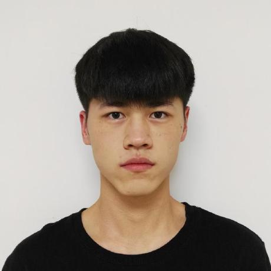

    
        
    
    <h1>韩佳乐</h1>
    

        
            邮箱:
            hanjiale@mail.ustc.edu.cn
        
        ·
        
            手机:
            15155101720
        
    

## 教育背景

- 中国科学技术大学 - 软件工程，强化学习 （研究生） 2021 - 至今
- 中国科学技术大学 - 计算机科学与技术 （本科） 2016 - 2021

## 项目

### 基于 K8S 的集群管理平台

_实验室项目 Go_

基于 K8S 搭建的集群管理平台，能够满足常见 AI 训练任务的需求，目前已实际用于实验室机器管理。（2022.12 – 2023.04）

- 整体采用微服务架构，网关模块，用户模块，任务模块等相互解耦，且均部署在集群中。其中网关模块通过 load balancer 暴露服务，任务模块通过 training-operator 服务启动 pytorchjob。
- 任务模块使用 informer 监听 pytorchjob，实时更新数据库中的任务状态。
- 数据库采用 pv/pvc 方式挂载 nas 存储服务器实现持久化存储。

### 强化学习科研

_论文投稿 Python_

一篇 CoG 论文在投。改进 PPO 算法，在提高其样本效率的同时保持稳定性。（2022.09 – 2023.03）

- 保存 PPO 的历史轨迹数据，在训练时重复利用，提高样本利用率。
- 使用双重要性系数裁剪来控制历史数据带来的高方差，保证训练的稳定性。

### 分布式训练框架（2021.10 – 2022.01）

_实验室项目 Python_

使用 actor-learner 架构搭建的分布式强化学习训练框架，在实验室广泛用于游戏 AI 比赛。

- 使用多进程，多 actor 并行收集数据，充分利用 CPU 资源。
- 使用分布式库 Horovod，多 learner 并行训练，加快训练速度。
- 在短时间内收集和利用大量数据，缓解强化学习中的高方差问题，大幅提高强化算法的性能。

### FFmpeg 中嵌入 YOLOv3 检测算法（2021.01 – 2021.05）

_本科毕设 C++_

使用 LibTorch 重写 YOLOv3 算法，然后嵌入到开源播放器 FFmpeg 中实现实时检测。这是[项目地址](https://github.com/hanjialeOK/YOLOv3-in-FFmpeg)。

- 性能上，可以播放多种类型视频文件，借助 1080Ti GPU 加速，帧率稳定达到 30 fps。
- 技术上，支持多种图像处理网络模型，如显著性检测算法，这是[项目地址](https://github.com/hanjialeOK/PoolNet-in-FFmpeg)。

## IT 技能

- 熟悉 C/C++，Python。
- 熟悉强化学习中的 PPO 算法，熟悉 tensorflow1 的使用。
- 对 AI 模型部署有一定了解，熟悉 Libtorch 的使用。
- 熟悉数据库，计算机网络，操作系统等基础知识。
- 熟悉 Linux 常用命令，以及 Docker，Git 等开发工具。

## 其他

- 语言: 英语 (六级 526)
